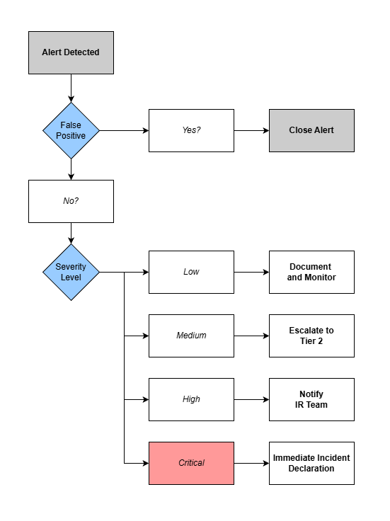

# Incident Escalation Playbook 🚨

## Overview
This project is a practical **Incident Escalation Playbook** designed to simulate the responsibilities of a **SOC Tier 1 Analyst** within a mid-sized enterprise environment.  

Rather than focusing on tools alone, this playbook emphasizes **decision-making, communication, and operational readiness** — the skills required to handle security alerts calmly and consistently in real organizational settings.

This project complements my other portfolio artifacts:
- **SIEM Log Analysis & Incident Investigation**
- **IT / Security Risk Register**

Together, they form a complete workflow of:

**Detection → Decision → Escalation → Improvement**

---

## Objectives 🎯
The purpose of this project was to design a structured and repeatable process that answers:

- When is an alert a false positive?
- How should incident severity be classified?
- Who should be notified, and how quickly?
- What evidence must be preserved?
- How should incidents be handed over to higher tiers?

The emphasis is on **judgment and clarity**, not just technology.

---

## Simulated Environment 🏢
- Mid-sized enterprise (~500 users)
- Centralized logging via SIEM
- Alerts from endpoint, network, and authentication sources
- 24/7 SOC coverage assumed
- Incident Response (IR) team available on-call
- No SOAR / automation assumed

---

## Key Components 🧩

### 1. Severity Classification 🔴🟠🟡
Incidents are categorized into four levels:

| Severity | Description |
|--------|------------|
| Low | Informational / benign |
| Medium | Suspicious activity requiring investigation |
| High | Confirmed malicious activity |
| Critical | Business-impacting incident |

---

### 2. Initial Triage Process 🔍
SOC Tier 1 workflow includes:
- Validating alert source and timestamps
- Reviewing correlated logs
- Identifying affected hosts or users
- Checking for repeated patterns
- Determining false positives

---

### 3. Escalation Flow 🔁
A simplified decision flow was designed to maintain clarity under pressure:

**Alert → Validate → Classify Severity → Escalate Accordingly**

Only **Critical** incidents trigger immediate incident declaration and management notification.

---

### 4. Escalation Matrix 📞

| Severity | Escalation Target | SLA |
|--------|------------------|-----|
| Medium | Tier 2 Analyst | 30 minutes |
| High | Incident Response Lead | 15 minutes |
| Critical | IR Team + Management | Immediate |

---

### 5. Evidence Preservation & Handover 🗂️
SOC Tier 1 analysts focus on proper transfer of responsibility rather than remediation:

- Preserve logs and artifacts  
- Avoid altering system state  
- Maintain event timelines  
- Protect chain of custody  

---

### 6. Documentation & Lessons Learned 📝
Each incident includes:
- Alert summary
- Severity classification
- Timeline of actions
- Escalation details
- Post-incident review metrics (MTTD, MTTR)

---

## Skills Demonstrated 💡
This project highlights transferable skills applicable to both **security** and **general IT roles**:

- Structured decision-making  
- Process and workflow design  
- Risk awareness  
- Documentation discipline  
- Communication and escalation judgment  
- Operational readiness  

---

## Deliverables 📄

👉 The completed Incident Escalation Playbook Report can be downloaded via my cybersecurity blog, [Happy Bytes](https://happy-bytes.vercel.app/blogs/cybersec-incident-escalation-playbook)

- Viewable on GitHub: [Incident Escalation Playbook Report (PDF)](report/Incident_Escalation_Playbook_Final.pdf)

---

## How This Fits Into My Portfolio 🧭
This artifact represents the **operational bridge** between technical detection and organizational response.  

It complements:
- **SIEM Log Analysis** → technical investigation  
- **Risk Register** → business and risk awareness  

Together, these projects demonstrate balanced capability across **technical, operational, and risk-focused domains**.

---

## Future Improvements (Optional) 🔧
- Expanded incident scenarios
- Automated escalation simulations
- Additional flow variations for hybrid environments

---

## License
This project is intended for **educational and portfolio demonstration purposes**.

---

*Feedback and discussion are welcome. Thank you for reviewing this project.* 🙏

